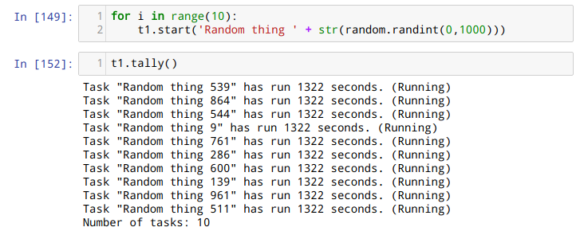

# TaskTimer
### A task tracker module to keep track of time spent in various tasks



## Use case
This module is used to track time spent on various tasks and make a simple report into a .csv file. At the current state it is run in a Jupyter notebook environment, but it can be used in any Python 3 environment.

## How to use
Go into the working directory, start up the Python 3 environment and do `import TaskTimer`.
After the module has been imported, an object can be created and used as per the example below:

```
>>> t = Timer('Timer')
>>> t.start('Task 1')
>>> t.tally()
Task "Task 1" has run 3 seconds. (Running)
Number of tasks: 1
>>> t.stop('Task 1')
>>> t.tally()
Task "Task 1" has run 10 seconds. (Stopped)
Number of tasks: 1
```

Multiple tasks can be tracked at the same time and each has their own state(running/stopped) and total duration. If you wish to save the progress of the tasks, you may use the `write`-method.

```
>>> t = Timer('Timer')
>>> t.start('Task 1')
>>> t.start('Task 2')
>>> t.start('Task 3')
>>> t.write('data/testfile')  # The method has filename for an argument.
Task "Task 1" has run 14 seconds. (Running)
Task "Task 2" has run 11 seconds. (Running)
Task "Task 3" has run 10 seconds. (Running)
Number of tasks: 3
```

The `write`-method has one argument for a filename or directory/filename. If a directory does not already exist, it will create one and write the .csv-file into it. In the case above, the file would be in the directory called 'data' and the filename would be 'testfile.csv'.

## Version 0.1

* Basic functionality - to be used as a module in a Python 3 environment.
